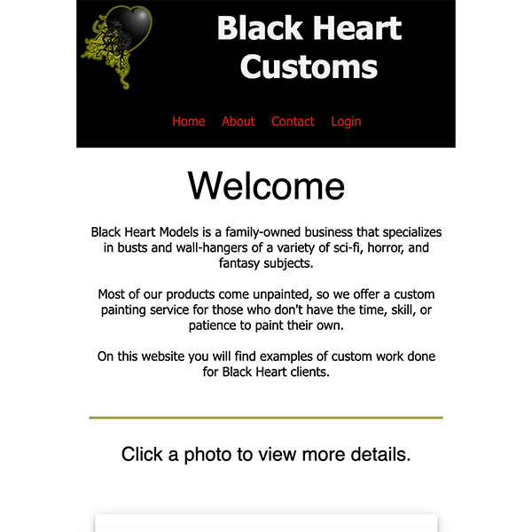

# Solo Project - Black Heart Customs

## Description
This mobile-friendly application displays custom paint work for customers of Black Heart Models. Users can view images, descriptions, and back stories. An "admin" user has the ability to add new kits and photos, or delete them. 

## Preview


## Demo
If you would like to view a video of my presentation and demo,
<a href="https://www.linkedin.com/posts/leigh-stephenson_fullstackdevelopment-primedigitalacademy-activity-7079883988697284608-tNAs?utm_source=share&utm_medium=member_desktop"> click here </a>

## Duration
This project was completed in 1 month for my Prime Digital Academy solo project. I spent 1 week planning and designing, and 3 weeks coding and styling. 

## Prerequisites

Before you get started, make sure you have the following software installed on your computer:

- [Node.js](https://nodejs.org/en/)
- [PostrgeSQL](https://www.postgresql.org/)
- [Nodemon](https://nodemon.io/)


## Technologies
React, Redux, Express, Passport, and PostgreSQL, Postico, Material UI, CSS, Amazon Web Services (S3 Buckets), 

## Create database and table

Create a new database called `blackheartcustoms` If you would like to name your database something else, you will need to change `blackheartcustoms` to the name of your new database name in `server/modules/pool.js`.

First, create a `user` table:

```SQL
CREATE TABLE "user" (
    "id" SERIAL PRIMARY KEY,
    "username" VARCHAR (80) UNIQUE NOT NULL,
    "password" VARCHAR (1000) NOT NULL
);
```

Next, create a `kit` table:

```SQL
CREATE TABLE "kit" (
    "id" SERIAL PRIMARY KEY,
    "name" VARCHAR (200),
    "description" VARCHAR (5000),
    "backstory" VARCHAR (5000),
    "user_id" INTEGER,
    "order" INTEGER
);
```

After that, create a `photos` table: 

```SQL
CREATE TABLE "photos" (
    "id" SERIAL PRIMARY KEY,
    "kit_id" INTEGER,
    "url" VARCHAR (5000) NOT NULL,
    "order" INTEGER DEFAULT 1
);
```

## Development Setup Instructions
-Open the built-in terminal in your editor of choice. I use Visual Studio Code.
- Run `npm install`
- You will need to sign up for AWS and create an s3 bucket named "blackheartcustoms" and IAM user. 
- Create a `.env` file at the root of the project and paste this code into the file:
  ```
  SERVER_SESSION_SECRET=superDuperSecret

  AWS_ACCESS_KEY_ID=EnterYourAccessKeyID

  AWS_SECRET_ACCESS_KEY=EnterYourSecretAccessKey

  AWS_REGION=EnterYourRegion
  ```
- While you're in your new `.env` file, take the time to replace `superDuperSecret` with some long random string like `25POUbVtx6RKVNWszd9ERB9Bb6` to keep your application secure. Here's a site that can help you: [https://passwordsgenerator.net/](https://passwordsgenerator.net/). If you don't do this step, create a secret with less than eight characters, or leave it as `superDuperSecret`, you will get a warning.
- You will replace the AWS keys with your new bucket and user information.
- Start postgres if not running already by using `brew services start postgresql`
- Run `npm run server`
- Run `npm run client`
- Navigate to `localhost:3000`

## Production Build

Before pushing to Heroku, run `npm run build` in terminal. This will create a build folder that contains the code Heroku will be pointed at. You can test this build by typing `npm start`. Keep in mind that `npm start` will let you preview the production build but will **not** auto update.

- Start postgres if not running already by using `brew services start postgresql`
- Run `npm start`
- Navigate to `localhost:5042`

## Deployment

1. Create a new Heroku project
1. Link the Heroku project to the project GitHub Repo
1. Create an Heroku Postgres database
1. Connect to the Heroku Postgres database from Postico
1. Create the necessary tables
1. Add an environment variable for `SERVER_SESSION_SECRET` with a nice random string for security
1. In the deploy section, select manual deploy

## Acknowledgement
Thanks to Chris Black and Marc McCarthy at [Prime Digital Academy](www.primeacademy.io) for teaching me all the skills needed to build this app. Thanks to everyone in the Tanzanite cohort for support and encouragement!

## Support
If you have any suggestions or issues, please email me at leighh.stephenson@gmail.com

Thanks for viewing!
